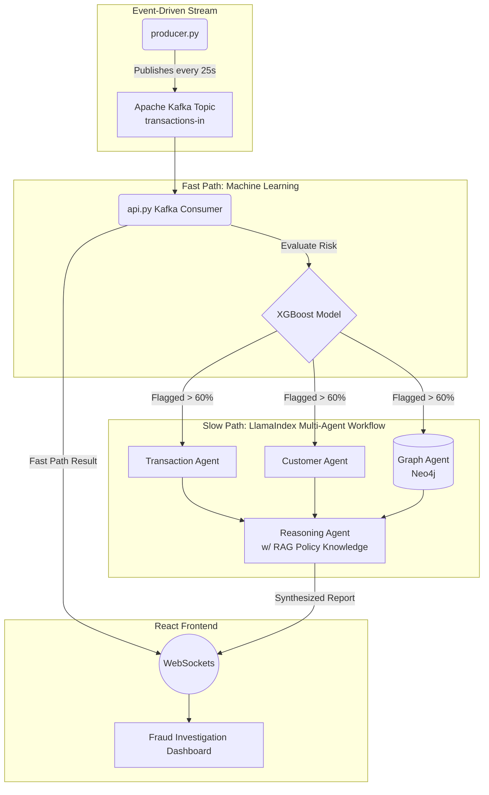

# 🛡️ FraudControl: Next-Gen AI Fraud Investigation Platform

FraudControl is an advanced, production-grade fraud detection and investigation platform. It combines the blazing speed of traditional Machine Learning (XGBoost) for real-time inference with the deep, nuanced reasoning capabilities of Large Language Models (LLMs) orchestrated in a multi-agent workflow.

---

## 🚀 Quick Start (Running the Application)

To bring the entire platform online locally, open 3 separate terminals:

**1. Start the Infrastructure (Terminal 1)**
```bash
# Start Kafka and Neo4j via Docker
docker start redpanda neo4j
```

**2. Start the Backend API & AI Agents (Terminal 1)**
```bash
cd pipeline
uvicorn api:app --reload --port 8000
```

**3. Start the Real-Time Kafka Stream (Terminal 2)**
```bash
cd pipeline
python producer.py
```

**4. Start the React Dashboard (Terminal 3)**
```bash
cd frontend
npm run dev
```
Then navigate to **http://localhost:5173** to watch the agents investigate live!

---

## 🏗️ System Architecture Flowchart

The system operates on a real-time Event-Driven architecture powered by Apache Kafka and WebSockets.



---

## 🧠 Machine Learning (The "Fast Path")

The first line of defense is a highly optimized XGBoost classifier trained to instantly detect fraudulent patterns.

- **Algorithm**: XGBoost (`xgboost`)
- **Training Data**: The model is trained on a combination of the highly-regarded **PaySim dataset** (a simulated dataset of mobile money transactions based on a sample of real transactions extracted from one month of financial logs from a mobile money service implemented in an African country) and our internally generated synthetic datasets.
- **Core Features**:
  - `amount`: The monetary value of the transaction.
  - `oldbalanceOrg`: The initial balance of the origin account before the transaction.
  - `newbalanceOrig`: The new balance of the origin account after the transaction.
  - `oldbalanceDest`: The initial balance of the destination account before the transaction.
  - `newbalanceDest`: The new balance of the destination account after the transaction.
- **Outcome**: The model assigns a `risk_score` from 0-100%. If the score exceeds the 60% threshold, the transaction is **flagged** and routed to the Agentic Slow Path for deep-dive investigation. If it falls below 60%, it is instantly approved to preserve system latency.

---

## 🤖 The Multi-Agent Workflow (The "Slow Path")

When a transaction is flagged, a team of specialized AI Agents is dynamically spun up using **LlamaIndex** Workflows and **OpenAI (GPT-4o/GPT-4o-mini)** models. These agents execute in **parallel** to gather context before a final decision is made.

### 1. Transaction Analysis Agent
- **Technology**: LlamaIndex + OpenAI
- **Role**: Analyzes the raw transaction data (amount, type, balance draining behavior) and generates a human-readable summary highlighting severe deviations (e.g., "Transaction drains nearly the entire origin account balance").

### 2. Customer Intelligence Agent
- **Technology**: LlamaIndex + OpenAI
- **Role**: Analyzes the customer's historical profile (KYC status, account age, recent failed logins, session velocity) to establish a risk profile (e.g., "Failed-login + sub-5s session velocity pattern consistent with Account Takeover").

### 3. Graph Analysis Agent
- **Technology**: Neo4j (Cypher) + LlamaIndex
- **Role**: Connects to a local **Neo4j Graph Database** to perform deep network traversal. It executes Cypher queries to check if the current customer shares devices or IPs with other users in the network, identifying massive, hidden fraud rings.

### 4. Reasoning Agent (The Synthesizer)
- **Technology**: LlamaIndex Retrieval-Augmented Generation (RAG) + OpenAI
- **Role**: Acts as the barrier step. It waits for the first three agents to finish, collects their parallel findings, and queries an internal **AML Policy Knowledge Base** using RAG. It then synthesizes all context into a final, actionable decision ("Approve", "Hold for Review", "Block") and explicitly cites the exact AML policy sections that were violated.

## 📜 AML Policy Rules (RAG Knowledge Base)

The Reasoning Agent relies on a strict internal Anti-Money Laundering (AML) policy document (stored in `pipeline/knowledge_base/aml_policy.txt`) to ground its decisions. The rules it enforces include:

### 1. Transaction Monitoring
- **High-Value**: Transactions over $10,000 must be manually reviewed.
- **Structuring (Smurfing)**: Multiple small transactions totaling over $10,000 in 24 hours require Tier 2 review.
- **Cash Types**: `CASH_OUT` and `TRANSFER` are high-risk (the "cash-out" leg) and are held if their risk score > 60%.

### 2. Customer Risk Classification
- **KYC Status**: "Pending" KYC requires 2FA for >$2,000. "Failed" KYC blocks all outbound transfers.
- **PEP (Politically Exposed Persons)**: Elevated to "Medium" risk, requiring Enhanced Due Diligence (EDD) for >$1,000.
- **Network Risk**: Sharing IPs/devices with 5+ accounts indicates mule/fraud rings, requiring graph investigation.
- **Account Takeover (ATO)**: 5+ failed logins combined with sub-5s session velocity indicates bot-driven ATO.

### 3. Velocity & Behavioral
- **Counterparties**: Transacting with 30+ unique counterparties in 30 days triggers "High (Network Risk)".
- **Baseline Deviation**: Transaction amounts exceeding 5x the customer's historical average heavily weight the risk score.

### 4. Escalation Actions
- **0-59%**: Approve.
- **60-84%**: Hold for Review (Slow Path) & require 2FA.
- **85-100%**: Block pending manual review and freeze outbound transfers.
- **SAR**: Any confirmed fraud or account violating multiple Section 2 policies requires generating a draft Suspicious Activity Report (SAR).

---

## 📅 Our Development Journey (How We Built This)

We evolved this architecture sequentially from a basic MVP to a production-ready streaming platform:

### Phase 1: Core Intelligence
We started by building the two brains of the operation: the ML Engine and the Agent Engine. We trained the XGBoost model on the PaySim dataset and configured the initial LlamaIndex workflow. Initially, the agents executed sequentially (Transaction -> Customer -> Reasoning) using a mocked REST endpoint.

### Phase 2: The React Dashboard
We built a beautiful, dark-themed UI in React. Initially, the dashboard was "pull-based". The user had to click a "Fetch Next Transaction" button which fired an `axios` GET request to the FastAPI backend, waiting synchronously for the ML model and the agents to finish computing.

### Phase 3: Graph Intelligence & Parallelization
To catch complex fraud rings, we integrated **Neo4j** via Docker. We ingested synthetic nodes and edges (users, devices, transactions) into the graph database. Simultaneously, we refactored the LlamaIndex workflow: instead of running sequentially, the Transaction, Customer, and new Graph agents were reprogrammed to execute **in parallel** concurrently, dramatically cutting down the total LLM inference time.

### Phase 4: Event-Driven Streaming Architecture & Advanced Queuing
In our final massive architectural shift, we replaced the slow, REST-based "pull" model with a real-time, event-driven "push" model.
1. We spun up an **Apache Kafka** broker in Docker.
2. We wrote a Python producer to simulate a live production stream (publishing 1 transaction every 25 seconds).
3. We rewrote the FastAPI backend to act as a background Kafka Consumer, successfully implementing a robust internal message queue to ensure data integrity during spikes in volume.
4. We upgraded the React frontend to passively listen to **WebSockets** and buffer transactions in a robust UI queue. Now, transactions flow onto the screen instantly, and OpenAI agent reports gracefully stream in asynchronously seconds later, mirroring a true enterprise architecture!

### Phase 5: Advanced Graph Intelligence (GNNs & Continuous Ingestion)
In our ultimate evolution, we embedded graph-level intelligence directly into the millisecond-latency Fast Path:
1. **Continuous Graph Ingestion**: We upgraded the FastAPI backend to asynchronously perform Cypher `MERGE` operations on every streamed transaction. This upserts new `TransactionNode`s and connects them to users in near real-time, allowing the Graph Agent to query a constantly evolving network topology.
2. **Graph Neural Networks (GNNs)**: We wrote a training pipeline that distills the entire Neo4j graph into a mathematical vector space using **Node2Vec**. These structural embeddings (e.g. `gnn_emb_0`, `gnn_emb_1`) were then fed into a newly trained XGBoost model (`xgb_model_gnn.json`). Now, the XGBoost Fast Path executes with deep relational graph awareness in milliseconds, completely bypassing the need for an expensive Cypher query on every single transaction!
